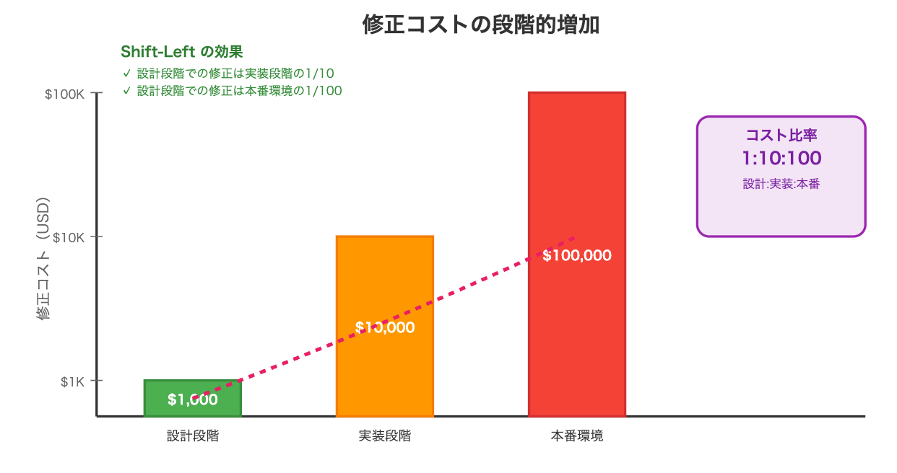
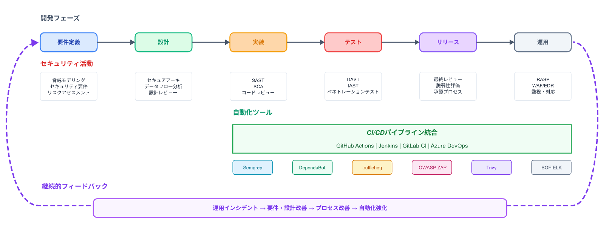

---
# You can also start simply with 'default'
theme: ./theme
# random image from a curated Unsplash collection by Anthony
# like them? see https://unsplash.com/collections/94734566/slidev
# background: https://cover.sli.dev
# some information about your slides (markdown enabled)
title: セキュリティ・キャンプのススメ
info: |
  ## セキュリティ・キャンプのススメ
  セキュリティ・キャンプに行ってきて学んだことを話します。
# apply unocss classes to the current slide
# class: text-center
# https://sli.dev/features/drawing
drawings:
  persist: false
# slide transition: https://sli.dev/guide/animations.html#slide-transitions
transition: slide-left
# enable MDC Syntax: https://sli.dev/features/mdc
mdc: true
colorSchema: light
# open graph
seoMeta:
  # By default, Slidev will use ./og-image.png if it exists,
  # or generate one from the first slide if not found.
  ogImage: auto
  # ogImage: https://cover.sli.dev
  twitterSite: yuito_it_
  twitterCard: summary_large_image
  articleAuthor: "Yuito Akatsuki"
  articlePublishedTime: "2025-08-13"
  articleModifiedTime: "2025-08-13"
layout: intro-image
image: "./static/imgs/seccamp-logo.webp"
talksSiteMetadata:
  event: UniProject Summer LT 2025
  date: "2025-08-14"
  location: Online
  topic: Recommend Secamp
  info: |
    セキュリティ・キャンプに行って学んできたことを話します。
---

  
    あかつきゆいと 2025/08/31
  

  <h1>セキュリティ・キャンプのススメ</h1>
  
〜seccamp2025参加記〜

---
transition: fade
---

  <!-- 自己紹介テキスト -->
  

    <v-animate name="fadeInDown">
      <h1 class="text-5xl font-extrabold text-pink-600 drop-shadow mb-2 tracking-tight">自己紹介</h1>
    </v-animate>
    <v-animate name="fadeInUp" :delay="300">
      
あかつきゆいと

      

         Kubernetes
         React
         Next.js
         Vue.js
         Docker
        🔒 Security
        etc...
      

      

        所属：
        <ul class="list-disc list-inside ml-4">
          <li>デジタル創作サークルUniProject</li>
          <li>S高等学校</li>
        </ul>
      

    </v-animate>
  

  <!-- 写真2枚（アイコン・顔写真）を右側に重ねて配置 -->
  

    <v-animate name="zoomIn">
      
    </v-animate>
    <v-animate name="zoomIn" :delay="200">
      
    </v-animate>
  

---

# セキュリティキャンプとは何か

> 「セキュリティ・キャンプ」は、学生に対して情報セキュリティに関する高度な技術教育を実施し、次代を担う情報セキュリティ人材を発掘・育成する事業です。
> <small>IPAより</small>

<!--
ここにいる皆さんはセキュリティキャンプについてすでに知っていらっしゃるかとは思いますが、少し説明すると、学生に対してセキュリティ技術を学んでもらうっていう合宿みたいなやつです。
-->

---
layout: fact
---

## セキュリティ・キャンプ 行ってきたよ

<!--
でまぁ、そんなところに行ってきたよと。
-->

---
layout: fact
---

## 何をしてきたのか

<!--
何をしてきたか
-->

---
layout: image
image: "/static/imgs/muhaijuku.png"
---

<!--
無敗塾というEdTechサービスを通じたセキュリティについて考えました。
今回はインシデント発生までを
-->

---
layout: fact
---

<v-clicks>

## 一番印象に残ったこと

## UniProでやりたいこと

</v-clicks>

<!--
じゃあ今回何を話すかというと一番印象に残ったことというよりは、UniProでやりたいことを中心に話していこうと思っています。
-->

---

# ログを集めよう

<v-clicks>

  

    <ul>
      <v-clicks>
        <li>ログを集めることはとても大事</li>
        <li>ログがなければ<strong>インシデントに気づけない・対処できない</strong></li>
        <li>なんのログを集めるかも大切
          <ul>
            <li>Audit Log</li>
            <li>通信のログ</li>
            <li>エラーログ
              <ul>
                <li>意図しない動作の検出</li>
              </ul>
            </li>
            <li>etc...</li>
          </ul>
        </li>
      </v-clicks>
    </ul>
  

  

    
    
  

</v-clicks>

<!--
まず初めに、ログを集めよう

- 構造化ロギング
- ログの形式を整える
  - どこまで揃えるかも重要

揃えすぎると今度は独自のパラメータに対応できない

UniProでは、GrafanaとLokiを使って頑張り始めましたよ
-->

---

# Dev Sec Ops / Shift-Left

<v-clicks>

- 開発の遅延を抑えてセキュリティを向上しよう

- アジャイルなどであるDevOpsにSecを加えてみる

- ウォーターフォールで、セキュリティを開発の前の設計段階で適用する**Shift-Left**

</v-clicks>

<!--
開発フローの話

アジャイルよりのDevSecOps、ウォーターフォール向けのShift-Leftについて話す

目的としては、(1)

例えば、
-->

---

# Shift-Left

<!--
Shift-Leftの効果

いつ修正するかによってコストが変わる

で、なるべく最初に修正する方が手間がかからないよ

なので、設計段階のうちにセキュリティについてよくよく考えておくことが大事
-->

---

# DevSecOps

<!--
DevSecOpsの図

要件定義の時にセキュリティに関してある程度考えておきますよ

各フェーズでそれぞれのセキュリティ活動を行いますよ

CI/CDで自動化することも有効ですよ
-->

---

# 設計パターンライブラリ

<v-clicks>

- 組織内パターンカタログを作成する

- ユースケースや実装ガイドをまとめておき、ベストプラクティスを共有する

## メリット

- 設計品質の標準化

- セキュリティリスクの低減

- 知識共有の促進

- 開発速度の向上

</v-clicks>

<!--
設計パターンライブラリ

組織内パターンカタログを作成する

例えば、
- OAuthクライアントのベストプラクティスはこんな感じ
- RBACはこんな感じで実装するべき
- ログインフォームのベストプラクティス
などをカタログ化して共有する

メリットとして
-->

---

# 脅威モデリング

<v-clicks>

- **STRIDE**

  - Spoofing(なりすまし)

  - Tampering(改ざん)

  - Repudiation(否認)

  - Information Disclosure(情報漏洩)

  - Denial of Service(サービス拒否)

  - Elevation of Privilege(権限昇格)

</v-clicks>

<!--
ここまでに話したセキュリティ対策をするために、じゃあどういう脅威があるかを知ろうというのがこれ

STRIDEというフレームワーク

否認は可用性の問題ですね。
特定の処理を拒んだときということですね。

サービス拒否
これは全体が落ちること、否認は一部が落ちること
-->

---

# 脅威モデリング

<v-clicks>

1. スコープの定義

2. アーキテクチャ分析

3. 脅威識別

4. リスク評価

</v-clicks>

<!--
順番は...

どこまでを対象にモデリングするか

DFD図の作成などどのような仕組みか

どのような種類か

どの程度の影響か
-->

---

# 言語化する

- 脅威文法を用いて考える
  - どこで
  - どんな時
  - どんなことをすれば
  - 何が
  - どういう影響を受ける
  - 犯人の目標は(機密性の低下、可用性の低下など)

<!--
さっきのモデリングしたやつを言語化することによって、具体的に何が問題なのかを明確に捉えられる
-->

---

# コンテナは完璧ではない

UniProではK8sを運用していますが...

<v-clicks>

- 一つのコンテナが侵害された時
  - ネットワークを制限していないと他のコンテナや内部ネットへ
  - コンテナブレイキング
    - イメージの脆弱性
  
- kubeAPI露出しているとやばくね

</v-clicks>

  
  

<!--
よく、コンテナは分離されているから安全とかほざいている人がいます(少し前の私ですね)

全然そんなことなくて...

今UniProで運用しているK8sで、捕捉しているものだけでも、これだけあります
-->

---

# セキュリティは技術者だけでは終わらない

セキュリティは一般人も意識しなければならないことです。

<v-clicks>

- MFA疲労攻撃

- PDFだと思ったものがMacの実行ファイルだった

- なりすまし

</v-clicks>

---
layout: section
---

# 最後に

---

# これからどうしていくか

<v-clicks>

- 今あるシステムの脅威モデリングをしてみる

- 権限の見直し
  - 最小権限の原則の徹底

- 非技術者への啓発

- ログを取る
  - 構造化ロギング
  - 共通化

- trivyを回す

</v-clicks>

---
layout: center
---

# 終わり
