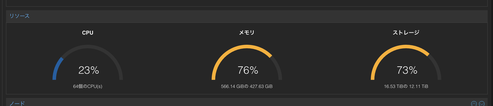
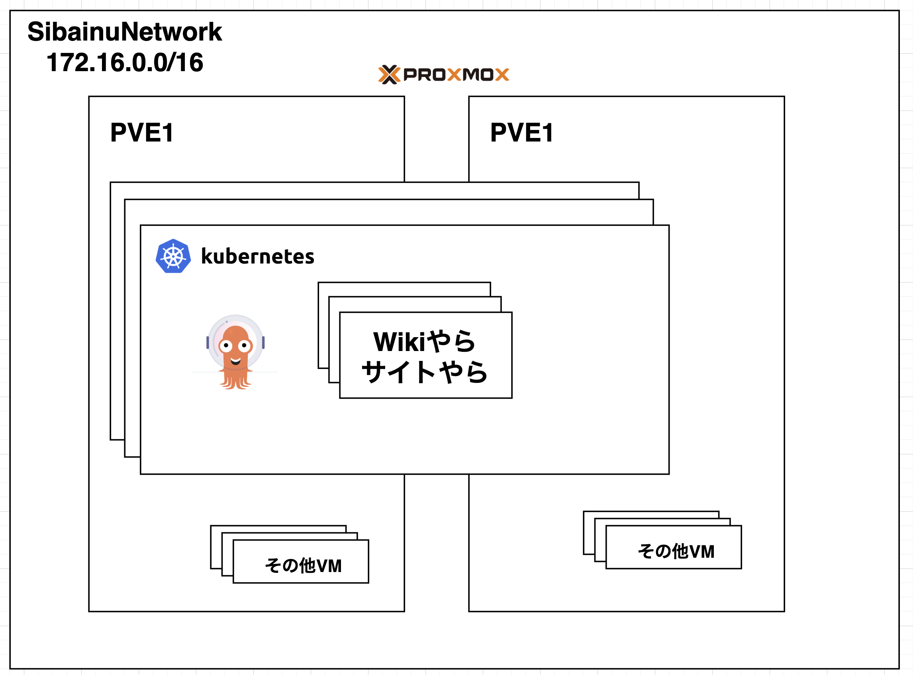

---
# You can also start simply with 'default'
theme: ./theme
# random image from a curated Unsplash collection by Anthony
# like them? see https://unsplash.com/collections/94734566/slidev
# background: https://cover.sli.dev
# some information about your slides (markdown enabled)
title: 高校生 オンプレK8s始めたってよ
info: |
  ## 高校生 オンプレK8s始めたってよ
  K8sやってるよっていう話と広告とセキュリティやり始めたよという話。
# apply unocss classes to the current slide
# class: text-center
# https://sli.dev/features/drawing
drawings:
  persist: false
# slide transition: https://sli.dev/guide/animations.html#slide-transitions
transition: slide-left
# enable MDC Syntax: https://sli.dev/features/mdc
mdc: true
colorSchema: light
# open graph
seoMeta:
  # By default, Slidev will use ./og-image.png if it exists,
  # or generate one from the first slide if not found.
  ogImage: auto
  # ogImage: https://cover.sli.dev
  twitterSite: yuito_it_
  twitterCard: summary_large_image
  articleAuthor: "Yuito Akatsuki"
  articlePublishedTime: '2025-08-13'
  articleModifiedTime: '2025-08-13'
layout: intro-image
image: "./static/imgs/k8s.webp"
talksSiteMetadata:
  event: All-Japan Security Camp 2025
  date: "2025-08-14"
  location: Tokyo
  topic: Starting K8s (and enhancing security)
  info: |
    K8sやってるよっていう話と広告とセキュリティやり始めたよという話。
---

  
    あかつきゆいと 2025/08/13
  

  <h1>高校生 K8sを始めたってよ</h1>
  
〜セキュリティを添えて〜

<!--
The last comment block of each slide will be treated as slide notes. It will be visible and editable in Presenter Mode along with the slide. [Read more in the docs](https://sli.dev/guide/syntax.html#notes)
-->

---
transition: fade-out
layout: image-right
image: ./static/imgs/icon.png
---

# 誰や

- あかつきゆいと
- 去年やられた高校の生徒
- UniPro創設者
- フルスタック園児にゃー(猫)
- なんか近畿でも中部でもない県にいるらしい

---
layout: fact
---

# 何話すん

---
layout: fact
hideInToc: true
---

<h2 style="font-size:3rem">K8sをオンプレで本番運用してるってよ</h2>

---
layout: fact
hideInToc: true
---

<h2 style="font-size:3rem">なんかおもろいサークル運営してるよ</h2>

---
hideInToc: true
---

# TOC

<Toc maxDepth=1 columns=1 />

---
layout: intro-image-right
image: "./static/imgs/router.png"
---

# プロフィール

- きっかけ
  - クラウドは高い()
  - うんちゃまさんの影響
  - なんか良さそう
  - **浪漫**
- のってるもの
  - サイト
  - Bot
  - Wiki
  - その他メンバーのシステム
- 規模
  - UniPro(後で)

---

# UniProとは

なんか色々しているサークルです。

- 音楽制作
  - UTAU
  - 自作曲
- デザイン/アート
  - 動画制作
  - デザイン
- プログラミング/エンジニアリング
  - Proxmox
  - K8s
  - Web

etc...

---
layout: section
---

# 啓蒙

**Proxmox/K8sをタダで貸す**ということ。

---
layout: fact
hideInToc: true
---

# クラウドは高い

---
layout: section
hideInToc: true
---

# リソースをタダで提供したい

- 学生はクラウドが高くてそんなに自由が効かない
  - 中学生はGitHubStudentなどの学割が効かないことも多い
- 実際、運用してみて、Proxmoxを使いたがる学生は多くいる
  - ゲームサーバーに使い出すのもご愛嬌、第一歩としてちょうどいい

---
layout: fact
---

# 写真集

---
layout: 3-images
imageLeft: './static/imgs/lac1.png'
imageTopRight: './static/imgs/hdd.png'
imageBottomRight: './static/imgs/lac2.png'
---

---
layout: fact
---

# スペック

---
hideInToc: true
theme: ./theme
layout: intro-image-right
---

# スペック

2ノード合わせたものです。

- CPU: EPYC 16Core x2
- RAM: 560GBくらい
- ストレージ: (HDDとSSDが混ざっていて計算するのがめんどいので割愛)
- OS: Proxmox VE
- VMが60台くらい立ってた記憶

---
layout: section
---

# K8s

知っての通り、オートスケーラブルなコンテナシステム。
便利。

---
layout: intro-image-right
hideInToc: true
---

# UniProでは

- microk8s
- ArgoCD
- Ingress
- Cert-manager
- Calico
- 5ノード

---
layout: intro-image
hideInToc: true
---

---
layout: section
hideInToc: true
---

# 最後に

- 権限管理の難しさ
  - OIDCを自作してみる
- どうリモートで教えていくか
- ぶっ壊したときが面倒
- IPv6通らないと環境の制約的に外部公開が厳しい
  - Ciliumよ、早くL2でできるようにしてくれ
- ゲーム鯖、入門にいいね

---
layout: section
hideInToc: true
---

# Thanks!

## 公開物

- このスライド - https://talks.yuito-it.jp/2025/seccamp
- UniPro
  - GitHub: @UniPro-tech
  - HP: https://uniproject.jp
  - Discord: https://uniproject.jp/Discord
