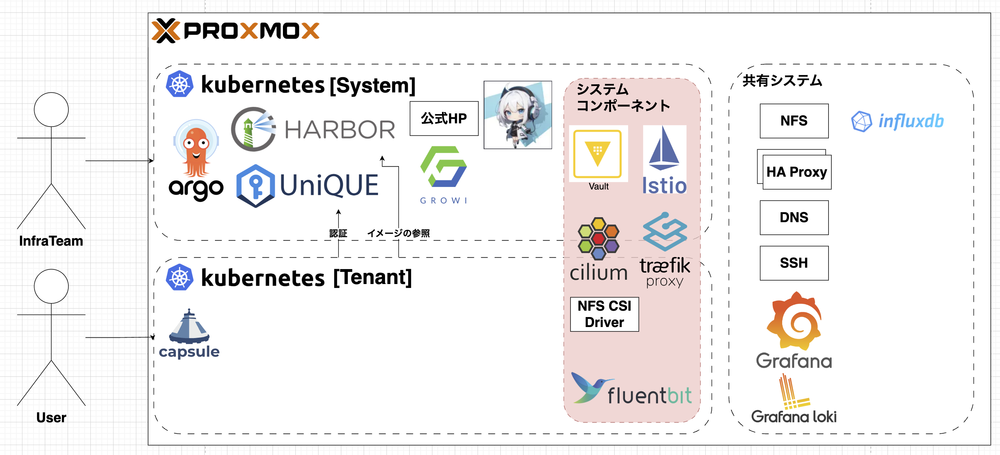

---
# You can also start simply with 'default'
theme: ../../../common/theme/UniPro_2
# random image from a curated Unsplash collection by Anthony
# like them? see https://unsplash.com/collections/94734566/slidev
# background: https://cover.sli.dev
# some information about your slides (markdown enabled)
title: UniProインフラのセキュリティ〜KubernetesとUniQUEの未来〜
info: |
  ## UniProインフラのセキュリティ〜KubernetesとUniQUEの未来〜
  Kubernetesマルチテナントの今後とUniQUEの完成と活用に関して話します。
# apply unocss classes to the current slide
# class: text-center
# https://sli.dev/features/drawing
drawings:
  persist: false
# slide transition: https://sli.dev/guide/animations.html#slide-transitions
transition: slide-left
# enable MDC Syntax: https://sli.dev/features/mdc
mdc: true
colorSchema: light
# open graph
seoMeta:
  # By default, Slidev will use ./og-image.png if it exists,
  # or generate one from the first slide if not found.
  ogImage: auto
  # ogImage: https://cover.sli.dev
  twitterSite: yuito_it_
  twitterCard: summary_large_image
  articleAuthor: "Yuito Akatsuki"
  articlePublishedTime: "2025-08-30"
  articleModifiedTime: "2025-08-30"
layout: intro-image
image: "./static/imgs/thumbnail.png"
talksSiteMetadata:
  event: UniProject Winter LT 2025
  date: "2025-12-25"
  location: Online
  topic: Next Step of UniQUE and K8s
  info: |
    Kubernetesマルチテナントの今後とUniQUEの完成と活用に関して話します。
duration: 10min
timer: countdown
---

  
    あかつきゆいと 2025/12/25
  

  <h1>UniProインフラのセキュリティ</h1>
  
〜KubernetesとUniQUEの未来〜

<!--
さて、大トリを務めさせていただきます。

UniProインフラのセキュリティ〜K8sとUniQUEの未来〜というタイトルでLTさせていただきます。
-->

---
transition: fade
---

  <!-- 自己紹介テキスト -->
  

    <v-animate name="fadeInDown">
      <h1 class="text-5xl font-extrabold text-pink-600 drop-shadow mb-2 tracking-tight">自己紹介</h1>
    </v-animate>
    <v-animate name="fadeInUp" :delay="300">
      
あかつきゆいと

      

         Kubernetes
         React
         Next.js
         Vue.js
         Docker
        🔒 Security
        etc...
      

      

        所属：
        <ul class="list-disc list-inside ml-4">
          <li>デジタル創作サークルUniProject</li>
          <li>S高等学校</li>
          <li>セキュリティ・キャンプ協議会 コミュニティ支援グループ</li>
        </ul>
      

    </v-animate>
  

  <!-- 写真2枚（アイコン・顔写真）を右側に重ねて配置 -->
  

    <v-animate name="zoomIn">
      
    </v-animate>
    <v-animate name="zoomIn" :delay="200">
      
    </v-animate>
  

<!--
もう自己紹介はあまりする必要もないですかね？

一応しておきますか、あかつきゆいとと申します。

ここ、UniProの創設者とかセキュキャン協議会の人やってたりします。
コンテナ技術とかWeb系とかセキュリティとか、色々やってるS高生です。
-->

---

# Agenda

1. Introduction
2. 現状と課題
3. UniQUEの未来
    - 何ができるか
    - UniQUEのこれから
4. Kubernetes 魔改造計画
    - システム構成
    - RBACとOIDC
    - Istio - mTLS
    - Cilium / Hubble
    - HashiCorp Vault - KMS
    - NFS CSI Driver - PV / PVC
    - ArgoCD - CD
    - Traefik Proxy - Ingress / Gateway
    - capsule - マルチテナント
5. Ending

<!--
今回のアジェンダです。

盛りだくさんですね。
-->

---
layout: section
---

# 1. Introduction

<!--
さて、Introduction
-->

---
layout: fact
---

<v-clicks>

<h1
  v-motion
  :initial="{ x: -80 }"
  :enter="{ x: 0, y: 0 }"
  :click-1="{ x: 0, y: 0 }"
  :click-2="{ y: -20 }"
>
〇〇の背中を預かる
</h1>

<h2 style="font-size: 3rem;margin-top: 20px;">UniProメンバーの背中を預かる</h2>

</v-clicks>

<!--
みなさん、この言葉、ご存知ですか？

[click]「〇〇の背中を預かる」という言葉、エンジニア全般によく言われる言葉ですね。

そして、我々UniProのインフラチームは[click]「UniProメンバーの背中を預かっている」わけですね。

みなさんが、快適に創作活動に取り組めるようなコミュニティづくり、環境づくりを技術を通して行なっています。
-->

---

# UniProのポリシー

UniProではこの3つを重要視しています。

<v-clicks>

1. できる限り無料で行う
1. できる限りオープンにする
1. できる限りセキュアにする

</v-clicks>

<!--
UniProでは、

- [click]できるだけ無料で行う
- [click]できる限りオープンにする
- [click]できる限りセキュアにする

この3つを大切にしています。

このうち、2と3は両立が難しいですね...
-->

---
layout: section
---

# 2. 現状と課題

<!--
さて、ここからは現状についてですね
-->

---

  
    2. 現状と課題
  

# ID管理

現在、UniProjectのメンバーには、以下のような機能を提供しています。

- UniWiki (GROWI)
- メール
- Proxmox VE
- Kubernetes
- 蔵雲 (Next Cloud)

etc...

<!--
現在、UniProではこのような様々なサービスが動いていますね。
-->

---
layout: fact
---

  
    2. 現状と課題
  

<v-clicks>

# アカウントは役員が手動で管理している

</v-clicks>

<!--
しかし、これらのアカウントはすべて、[click]**役員が手動で管理しています**。
-->

---

  
    2. 現状と課題
  

# KubernetesとProxmoxマルチテナント

Proxmox VEとKubernetesでは、以下のような問題が発生しています。

<v-switch>

<template #1>

- Proxmox VEのAdmin権限をもってしても、VMの監査ログを取れない
    - VMのログを全て取り切っていないため、SSHのアタックなどを完全に検知できていない
- KubernetesのRBACが曖昧
- KubernetesのClusterAdmin権限を用いれば、全てのsecretの中身を覗くことができてしまう
    - とはいえ、Kubernetesの管理者を育成するという観点からClusterAdminはつけておきたい
- マイクロサービスアーキテクチャを目指しているにも関わらずmTLSすら組んでいない
- KubernetesやProxmox VEのユーザー作成がだるい
- いっぱいあるサービスでアカウントの使い分けがだるい

</template>

<template #2>

- Proxmox VEのAdmin権限をもってしても、VMの監査ログを取れない
    - VMのログを全て取り切っていないため、SSHのアタックなどを完全に検知できていない
- **KubernetesのRBACが曖昧**
- **KubernetesのClusterAdmin権限を用いれば、全てのsecretの中身を覗くことができてしまう**
    - **とはいえ、Kubernetesの管理者を育成するという観点からClusterAdminはつけておきたい**
- **マイクロサービスアーキテクチャを目指しているにも関わらずmTLSすら組んでいない**
- **KubernetesやProxmox VEのユーザー作成がだるい**
- **いっぱいあるサービスでアカウントの使い分けがだるい**

</template>

</v-switch>

<!--
そして、それらのシステムを支える技術、KubernetesとProxmoxのマルチテナント運用では、とても多くの問題が発生しています。

[click]特にKubernetesの権限管理とセキュリティ面が顕著ですね。
[click]そして、今回はこの4つに関してお話しします。
-->

---
layout: section
---

  <h1>3. UniQUE の未来</h1>

<!--
さて、ここからは、みなさんお待ちかねのサービスUniQUEのお話です。
-->

---
transition: none
---

  
    2. 現状と課題
  

# KubernetesとProxmoxマルチテナント

Proxmox VEとKubernetesでは、以下のような問題が発生しています。

<v-switch>

<template #1>

- Proxmox VEのAdmin権限をもってしても、VMの中身を除けない
    - VMのログを全て取り切っていないため、SSHのアタックなどを完全に検知できていない
- **KubernetesのRBACが曖昧**
- **KubernetesのClusterAdmin権限を用いれば、全てのsecretの中身を覗くことができてしまう**
    - **とはいえ、Kubernetesの管理者を育成するという観点からClusterAdminはつけておきたい**
- **マイクロサービスアーキテクチャを目指しているにも関わらずmTLSすら組んでいない**
- **KubernetesやProxmox VEのユーザー作成がだるい**
- **いっぱいあるサービスでアカウントの使い分けがだるい**

</template>

<template #2>

- Proxmox VEのAdmin権限をもってしても、VMの中身を除けない
    - VMのログを全て取り切っていないため、SSHのアタックなどを完全に検知できていない
- **KubernetesのRBACが曖昧**
- **KubernetesのClusterAdmin権限を用いれば、全てのsecretの中身を覗くことができてしまう**
    - **とはいえ、Kubernetesの管理者を育成するという観点からClusterAdminはつけておきたい**
- **マイクロサービスアーキテクチャを目指しているにも関わらずmTLSすら組んでいない**
-  ~~**KubernetesやProxmox VEのユーザー作成がだるい**~~ 
-  ~~**いっぱいあるサービスでアカウントの使い分けがだるい**~~ 

</template>

</v-switch>

<!--
[click]ここでは、これだけある課題のうちのこれが消えます。[click]
-->

---

  
    3. UniQUEの未来
  

# UniQUEの現状

UniQUEとは、**UniProjectのメンバー管理ができる統合認証基盤**であり、2024年の夏頃から計画され、開発されてきた。

<v-switch>

<template #1>
  

    

      

        

        

          

            
1

            
設計開始 2024 B

          

          

            
2

            
設計完了 2025 B

          

          

            
3

            
開発開始 2025 C

          

          

            
4

            
Open Beta 2025 D

          

          

            
5

            
Open Beta 2026 A

          

        

      

    

    

      <h3 class="text-2xl font-bold text-pink-600">Stage 4 — Open Beta (2025 D)</h3>
      <ul class="list-disc ml-6 mt-3 text-lg">
        <li>基本認証フロー（ログイン・SSO）</li>
        <li>グループとロールの管理</li>
        <li>メンバー登録申請の管理</li>
      </ul>
    

  

</template>

<template #2>
  

    

      

        

        

          

            
1

            
設計開始 2024 B

          

          

            
2

            
設計完了 2025 B

          

          

            
3

            
開発開始 2025 C

          

          

            
4

            
Open Beta 2025 D

          

          

            
5

            
Production 2026 A

          

        

      

    

    

      <h3 class="text-2xl font-bold text-green-500">Stage 5 — Production (2026 A)</h3>
      <ul class="list-disc ml-6 mt-3 text-lg">
        <li>監査ログ</li>
        <li>バグ修正</li>
        <li>ドキュメント整備</li>
      </ul>
    

  

</template>

</v-switch>

<!--
で、UniQUEってなんぞやっていう話なんですけど、**UniProメンバーの管理ができる統合認証基盤**で、要するにGoogleでログインみたいなものです。

去年の夏頃から計画され、ようやく完成が見えてきました。

[click]2025年度Dクオータには、
- ログインとSSO
- メンバーの管理
- メンバー登録申請からDiscord鯖への追加
- ロールの自動更新
- DMへ送信
がベータ版としてリリースできる予定です。

[click]また、2026年度Aクオータには、監査ログ取りをしたりドキュメントを整備して、より便利に改良する予定です。
-->

---
layout: section
---

# 4. K8s 魔改造計画

- システム構成
- Istio - mTLS
- Cilium / Hubble
- HashiCorp Vault - KMS
- NFS CSI Driver - PV / PVC
- ArgoCD - CD
- Traefik Proxy - Ingress / Gateway
- RBACとOIDC
- capsule - マルチテナント

<!--
それに伴って、Kubernetesを魔改造する必要性が出てきました。

ここからはKubernetesのお話です。
-->

---
layout: fact
---

  
    4. K8s 魔改造計画
  

<v-clicks>

<h2
  v-motion
  :initial="{ scale: 3, x: -80 }"
  :enter="{ scale: 3, x: 0, y: 0 }"
  :click-1="{ scale: 3, x: 0, y: 0 }"
  :click-2="{ scale: 1.5, y: -20 }"
>
メンバーの背中を預かる
</h2>

<h2 style="font-size: 3rem;">
→セキュリティが重要
</h2>

</v-clicks>

<!--
さて、ここで、最初の言葉を思い出してみましょう。

[click]**メンバーの背中を預かる**ということは、[click]**セキュリティが重要**ということになりますよね。

しかし、現在のクラスターでは、役員でないメンバーでもUniQUE内の個人情報にアクセスできてしまう可能性が高かったり、せっかくのOIDC認証をうまく活かせないなどの課題があります。

それをうまく解決するために、今回、完全に1からシステムを組み直しています。
-->

---

  
    4. K8s 魔改造計画
  

## システム構成図

<!--
システム構成図は以下のとおりです。

Kubeadmとcri-oで構成されており、HA Proxyとkeep-alivedによる仮想IPにより、kube-api serverを冗長化してHA構成を実現しています。

さて、詳しくみていきましょう。
-->

---
layout: fact
---

  
    4. K8s 魔改造計画
  

<v-clicks>

<h2
  v-motion
  :initial="{ scale: 1, x: -80, y: 150 }"
  :enter="{ x: 0, y: 150 }"
  :click-1="{ x: 0, y: 150 }"
  :click-2="{ scale: 0.6, y: -20 }"
  style="font-size:4rem"
>
大きな2つのクラスター
</h2>

  

    

      
🔧

      <h3 class="text-xl font-extrabold text-pink-600">System Cluster</h3>
    

    
UniPro の基盤サービスが稼働するクラスタ。 ここが止まると Tenant 側の運用に 影響が出るため堅牢に運用する。

    <h4 class="mt-2 font-semibold text-sm">稼働サービス例</h4>
    <ul class="list-disc ml-5 text-sm space-y-1">
      <li>UniQUE（認証・ID基盤）</li>
      <li>ArgoCD（GitOps / CD）</li>
      <li>UniBot（運用自動化）</li>
      <li>Growi（Wiki）</li>
      <li>共通監査・ログ基盤 等</li>
    </ul>
  

  

    

      
🧩

      <h3 class="text-xl font-extrabold text-sky-600">Tenant Cluster</h3>
    

    
メンバーやプロジェクト単位で分離された利用者向け クラスタ。System の認証／CD を使って テナントごとに管理する想定。

    <h4 class="mt-2 font-semibold text-sm">想定される利用</h4>
    <ul class="list-disc ml-5 text-sm space-y-1">
      <li>メンバー個別の開発環境・ネームスペース</li>
      <li>学習用ワークロード（イベント／常設）</li>
      <li>各種アプリのデプロイ（メンバー公開用）</li>
      <li>リソース分離とポリシー適用</li>
    </ul>
  

</v-clicks>

<!--
さて、今回の構成の大きな特徴は、[click]**2つの大きなクラスターです**。

[click]これらは大きくSystemクラスターとTenantクラスターに分かれます。

SystemクラスターはUniProの基盤サービスが稼働しており、UniQUEやGrowiなどを運用します。

また、テナントクラスターはシステムクラスターが稼働していることを前提とし、UniQUEのOIDCやシステムを使用して、広くメンバーに開放します。

テナント運用については後述します。
-->

---

  
    4. K8s 魔改造計画
  

## Istio - mTLS

<v-clicks>

- 送信者証明
- KubernetesではIstioというものを導入することにより簡単に行える

</v-clicks>

<!--
まずはIstioです。

Istioは、[click]mTLS、すなわち送信者証明をするものです。
[click]KubernetesにHelmですぐ導入できます。
-->

---

  
    4. K8s 魔改造計画
  

## Cilium / Hubble

<v-clicks>

- Kubernetesのクラスターネットワークを司るCNI
- L2 / IPv6 NDPに対応したので導入
- Hubbleにより高度なモニタリングができる

</v-clicks>

<!--
[click]CiliumはKubernetesのネットワークを司るCNIというものです。

[click]前まではL2によるIPv6仮想IPが使えなかったのですが、つい数ヶ月前にマージされたPRで対応しました。preview版で使えるらしいので導入しました。

[click]また、Hubbleというシステムにより、どこのPodがどこのサービスに送信し、どこのPodにルーティングされたかまで、高度なモニタリングができます。
-->

---

  
    4. K8s 魔改造計画
  

## HashiCorp Vault - KMS

<v-clicks>

- Cluster AdminではSecretが見えてしまう
- Vaultを使うことにより、Vaultのマスターキーもしくは権限を持つユーザーのみが機密情報を管理できるようになる
- 要するに、**権限を分離できる**

</v-clicks>

<!--
HashiCorp VaultはいわゆるKMSです。

[click]Cluster Admin権限をインフラチームに与える従来の権限管理では、シークレットが見えてしまいます。

[click]しかし、Vaultを使うことにより、Vaultのマスターキーもしくは権限を持つユーザーのみが機密情報を管理できるようになります。

[click]要するに、権限を分割できます。

UniQUEを扱う上で、DBのパスワードの管理に使えます。
-->

---

  
    4. K8s 魔改造計画
  

## NFS CSI Driver - PV / PVC

<v-clicks>

- PV/PVCを手で作るとなると**NFSサーバーの権限を与える必要がある**
- 直接操作はさせたくない
- これを使うことにより、Kubernetes側からの操作のみでプロビジョニングできる

</v-clicks>

<!--
これは、現在のクラスターでも運用していますが、NFS CSI Driverですね。

[click]永続ボリュームであるPV/PVCを手で作るとなると、NFSサーバーにディレクトリを作って直に指定してあげる必要があり、なんとも権限の部分でモヤモヤが残ります。

[click]もちろん、ディレクトリの作成権限を与えるということは、削除権限も与えることになりますし、中身も見放題でとてもよろしくないですね。
そこで、直接操作をしない方法を模索しました。

[click]このドライバーを使い、ストレージクラスを使用することで、PVCからPVを自動的にプロビジョニングすることができ、NFSのユーザー作成の手間を省いたりセキュリティ上の懸念を払拭することができます。
-->

---

  
    4. K8s 魔改造計画
  

## ArgoCD - CD

<v-clicks>

- いつものCDパイプライン
- OIDC認証も内部のRBACも使用するが、基本的にはOIDC
- マルチクラスターの設定を施す

</v-clicks>

<!--
[click]これも今のクラスタでも運用していますね。

[click]OIDC認証もArgoCDの独自のRBACも使いますが、基本的にはUniQUEでアクセスしてもらいます。

[click]マルチクラスターの設定を施し、SystemもTenantもどちらも操作できるようにする予定です。

Systemが落ちた時のためにArgoCD独自の通常アカウントも発行するというのはちょっとどうなのというのがあるので、現在良い方法を模索中です。
-->

---

  
    4. K8s 魔改造計画
  

## Traefik Proxy - Ingress / Gateway

<v-clicks>

- ミドルウェアなどの設定項目が豊富
- 簡単にOIDC認証をサイトにつけることができる

</v-clicks>

<!--
こちらも現在のクラスターでも導入されていますね。
これは、Nginxのリバースプロキシみたいなことをしてくれるものです。

これを導入したきっかけとしては、

[click]ミドルウェアなどの設定項目が豊富で、拡張性がとても高いこと、

そして、[click]ミドルウェアを用いることで、OIDC認証をつけることができ、メンバー用サイトを簡単にデプロイできます。
-->

---

  
    4. K8s 魔改造計画
  

## RBACとOIDC

<v-clicks>

- Tenantクラスターは原則OIDC認証する
- InfraTeamのみUserでの認証を行う
- SystemクラスターのClusterAdminは役員のみに与える

</v-clicks>

<!--
さて、本命、RBACとOIDCです。

[click]大前提として、せっかくの認証基盤があるので、Tenant側は完全にOIDC認証にします。
OIDCが死んだ時はSystem側をいじりますし、テナント側の問題であったとしても、Static PodであるAPIサーバーの設定をいじるのにKubernetesの権限は必要としません。ホスト権限をインフラチームに与えるのみで済みます。

[click]System側は通常のユーザー認証です。これは、kubectl configでx509証明書を用いた認証です。

[click]SystemクラスターのAdminは役員のみに与えることで、メンバーの個人情報が入っているUniQUEには触らせないようにします。
-->

---

  
    4. K8s 魔改造計画
  

## capsule - マルチテナント

<v-clicks>

- マルチテナントを簡単に行うことのできるcapsuleを使用する
- テナントに対して親子関係を持つ名前空間を作成できる

</v-clicks>

<!--
最後にcapsuleです。
これは、今回の構成で新登場ですね。

[click]これでは、クラスターリソースを含め、マルチテナントを簡単に構築することができます。

[click]また、テナントに対して親子関係を持つ名前空間を作成することができるため、メンバーが作ったアプリケーションが複数ある場合でも容易に管理できると想定しています。

また、もちろんのこと、クオータ機能があるため、テナントごとにリソース制限をかけることもできます。
-->

---
layout: section
transition: none
---

# 5. Ending

<!--
最後にですね、まだまだUniQUEも不完全なものですし、Kubernetesの新環境も出来たてほやほやです。

これからも色々とご迷惑をおかけすることもあるかとは思いますが、インフラチームもそこそこに難しいことしてるんだなぁと温かく見守っていただけると幸いです。

私も来年いないですしね、尚更ですね。
-->

---
layout: end
---

<!--
というわけで、これで終わります。
ありがとうございました！！
-->
