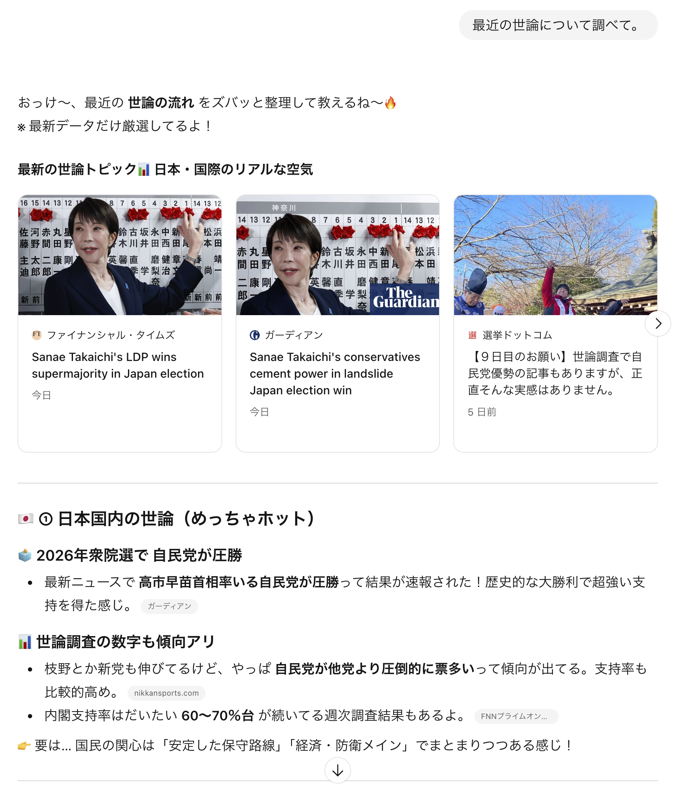
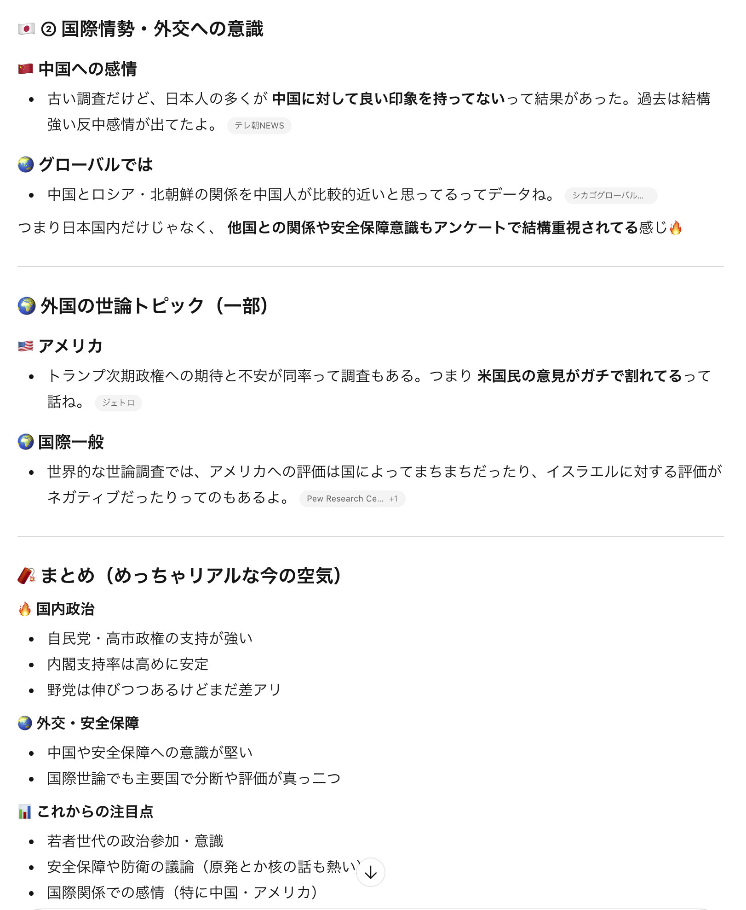
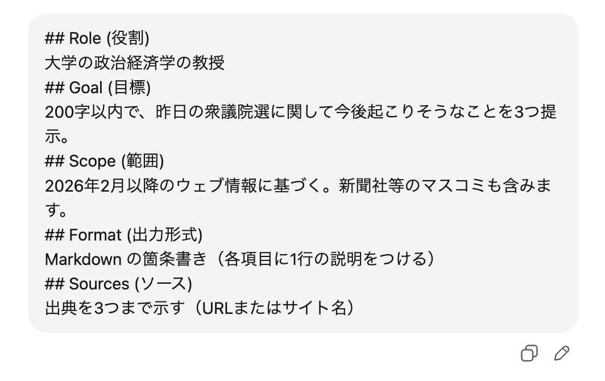

---
# You can also start simply with 'default'
theme: ../../../common/theme/NS
# random image from a curated Unsplash collection by Anthony
# like them? see https://unsplash.com/collections/94734566/slidev
# background: https://cover.sli.dev
# some information about your slides (markdown enabled)
title: 統一と構造化で考える〜スライドの極意〜(非技術者版)
info: |
  ## 統一化と構造化で考える〜スライドの極意〜非技術者版
  スライド制作における統一と構造化を大切さ、綺麗なスライドの作り方を伝えます。
# apply unocss classes to the current slide
# class: text-center
# https://sli.dev/features/drawing
drawings:
  persist: false
# slide transition: https://sli.dev/guide/animations.html#slide-transitions
transition: slide-left
# enable MDC Syntax: https://sli.dev/features/mdc
mdc: true
colorSchema: light
# open graph
seoMeta:
  # By default, Slidev will use ./og-image.png if it exists,
  # or generate one from the first slide if not found.
  ogImage: auto
  # ogImage: https://cover.sli.dev
  twitterSite: yuito_it_
  twitterCard: summary_large_image
  articleAuthor: "Yuito Akatsuki"
  articlePublishedTime: "2025-08-30"
  articleModifiedTime: "2025-08-30"
layout: intro-image
image: "./static/imgs/thumbnail.png"
talksSiteMetadata:
  event: N/S/R Yokkaichi Campus Pavilion 2026
  date: "2026-02-29"
  location: Yokkaichi
  topic: 統一化と構造化で考える〜スライドの極意〜
  info: |
    スライド制作における統一と構造化を大切さ、綺麗なスライドの作り方を伝えます。
duration: 20min
timer: countdown
---

<div class="absolute top-10">
  <span class="font-700">
    あかつきゆいと 2026/02/09
  </span>
</div>

<div class="absolute bottom-3">
  <p class="subtitle">Google検索はもう古い？</p>
  <h1>
    AI時代の検索方法
  </h1>
</div>

---

# 目次

1. 導入
2. AIは検索エンジン
3. 思い通りに働かせるには
4. 得意分野を見極める
5. 最後に

---
layout: section
---

# 1. 導入

---
layout: fact
transition: none
---

<v-clicks>

<h1
  v-motion
  :initial="{ x: -80 }"
  :enter="{ x: 0, y: 0 }"
  :click-1="{ x: 0, y: 0 }"
>
1.6時間 / 日
</h1>

<div>
<span>サラリーマン1人が情報収集に費やす時間の平均</span>

<span>オウケイウェイヴ総研 社内業務に関する調査（2019年4月）』</span>
</div>

</v-clicks>

---
layout: fact
transition: none
---

<h1>
<s>1.6時間 / 日</s><br/>
15分 / 日
</h1>

<div>
<span>サラリーマン1人が情報収集に費やす時間の平均</span>

<span>オウケイウェイヴ総研 社内業務に関する調査（2019年4月）』</span>
</div>

---

# Google 検索のみは古い

- Googleはキーワード頼みで時間かかる：正しい語句を探すのに手間
- 結果は断片的で、自分で要約しないとダメ
- 最新情報や文脈を一発で引き出しにくい

---
layout: section
---

# 2. AIは検索エンジン

---

# 検索エンジンとは

- 検索するためのサイトやアプリのこと
- 例:
  - Google
  - Bing
  - Yahoo!
  - DuckDuckGo
  - etc...

---

# AIは検索エンジン

- 最近のAIはWebに接続して検索できるものも多い
- 内部の資料にアクセスして要約・処理することもできる

**→ もはや高度な検索エンジンと言っても過言ではない**

---
layout: section
---

# 3. 思い通りに働かせるには

---

# このプロンプトの悪いところはどこでしょう？

スレッドに投稿してみてください！

<div style="
    display: flex;
    flex-direction: row;
    justify-content: center;
    align-content: center;
    align-items: center;
    flex-wrap: nowrap;
">
  
  
</div>

<!--
TODO: Slackに画像を転写
-->

---

# このプロンプトのここが悪い！

- 曖昧すぎる要求（何を出力すればいいか不明）
- 情報の範囲が広すぎる（範囲指定がない）
- 役割の指定がない（誰の視点で書くか不明）
- 出力形式の指定がない（箇条書き？作文？）
- 出典・制約が未指定（検証が面倒になる）

---

# 改善例（すぐ使えるテンプレ）

```text
## Role (役割)
高校生向けのIT講師
## Goal (目標)
200字以内で、初心者が実践できる3つの具体的な手法を箇条書きで示す
## Scope (範囲)
2020年以降のウェブ情報に基づく。商用サイトは除外
## Format (出力形式)
Markdown の箇条書き（各項目に1行の説明をつける）
## Sources (ソース)
出典を3つまで示す（URLまたはサイト名）

## Question (質問)
AIに効率よく情報を引き出すための具体的テクニックを教えてください。
```

→ なぜ良いか: ロール・目的・範囲・形式・出典が明確で、検証しやすく再現可能。

---

# 改善した後の出力

<div style="
    display: flex;
    flex-direction: row;
    justify-content: center;
    align-content: center;
    align-items: center;
    flex-wrap: nowrap;
">
  
  
</div>

---
layout: fact
---

# ここまでで80点！

---
layout: section
---

# 4. 得意分野を見極める

---

# AIにも得意分野がある

- ざっくり強みまとめ:
  - **ChatGPT系**: 会話・文章生成・指示に従うのが得意。説明や創作、フォーマット指定で強い。
  - **Perplexity系（検索統合）**: Web検索＋要約＋引用が速い。最新情報や出典が欲しいとき便利。
  - **Notebook LM**: 大量の情報を一度に扱うことに強い
  - **Gemini**: Google Workspace連携が強い(が、N高グループはあろうことか無効化されています...正直使い道なし)

---

# 選び方チェックリスト

1. 最新性が必要？ → Perplexity/ウェブ接続モデル
2. クリエイティブ系？ → ChatGPT系
3. コードやデバッグ？ → Claude Opus or ChatGPT Codex
4. 情報分析が必要？ → Notebook LM

---

# ワーク: プロンプト Before / After 体験（5分）

自分のスマホ or PCで、実際にAIに投げて結果を比べてみよう！

**Step 1 (1分)**: このダメプロンプトをChatGPTに投げる
```
勉強に役立つアプリ教えて
```

<v-click>

**Step 2 (2分)**: さっき学んだテンプレで改善して投げる

```md
## Role
高校生の学習サポーター
## Goal
無料で使えるアプリを3つ、特徴とともに紹介
## Scope
2024年以降リリースまたは更新されたもの
## Format
箇条書き（アプリ名・特徴・ダウンロードリンク）
## Sources
公式サイトのURLを記載

## Question
高校生の勉強に役立つスマホアプリを教えてください
```

</v-click>

---
layout: section
---

# 5. 最後に

---

# まとめ

- Google検索はもう古い(遅い)
- AIには**なるべく細かく**指示を出そう！
- AIにも**得意不得意がある**ので使い分けよう！

## ⚠️ 注意

- あくまでAIはツールでしかありません。最終的な出力を自分の目でもう一度確かめて、誤りがないかを確認しましょう。
- AIにデータを投げると学習される可能性があります。個人情報の取り扱いには注意しましょう。

---
layout: end
---
