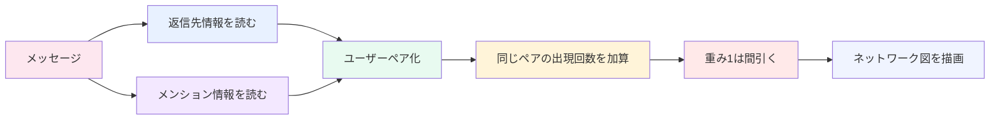
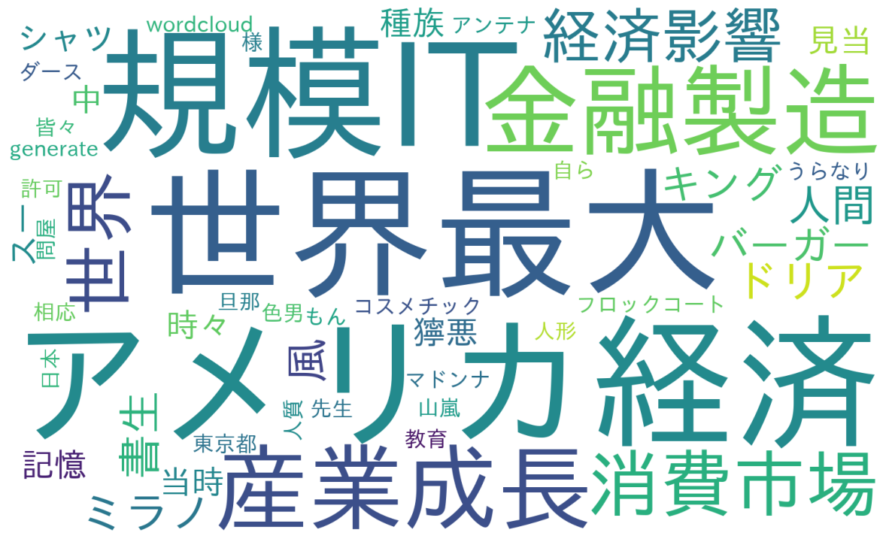
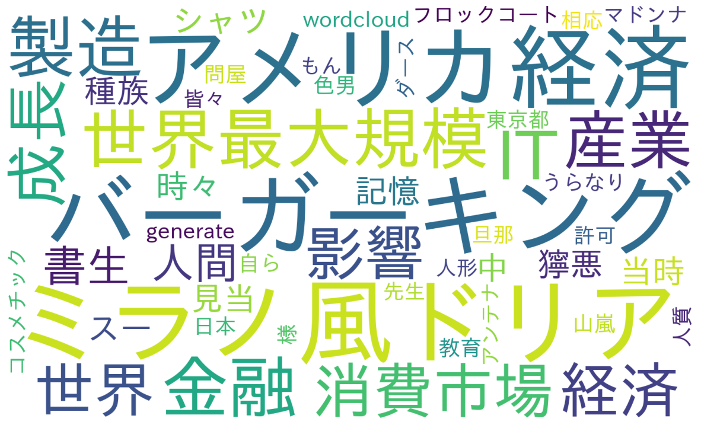

<!-- markdownlint-disable MD033 MD025 MD046 -->

  
    あかつきゆいと / N高グループ 通学コースLT 2025 2nd
  

  
Discord の会話を、あとから読める知見に変える

  <h1 class="mb-4">DiscordAnalyzeBot</h1>
  
メッセージ収集・解析・ワードクラウド可視化

<!-- TODO:画像 -->

<!--
今日は DiscordAnalyzeBot という、コミュニティの会話を見える化する Bot を紹介します。

Discord のログを集めるだけで終わらず、解析して、ワードクラウドとして返すところまでを自動化したものです。
-->

---

# TL;DR

  

    
目的

    
会話ログを 読める情報に変える

    
Discord の発話を集めて、話題や会話の雰囲気を見える化する。

  

  

    
主な機能

    <ul class="text-sm space-y-2">
      <li>メッセージ保存</li>
      <li>テキスト前処理</li>
      <li>ワードクラウド生成</li>
      <li>会話ネットワーク生成</li>
      <li>Bot コマンド応答</li>
    </ul>
  

  

    
今日の見どころ

    

      言葉をうまくまとめる処理（形態素解析 + 連続語学習）で、
      バラけた単語を「読める話題」に育てるところ。
    

  

  専門用語は必要なところだけに絞って、意味が伝わる言い換えを優先して話します。

<!--
このスライドでは、まず結論だけ伝えます。

このBotは「会話ログをただ保存する」だけではなく、
話題の中身（ワードクラウド）と、誰が誰と話しているか（ネットワーク）を見えるようにします。

今日は特に、言葉をどう扱うと結果が読みやすくなるかに絞って話します。
-->

---

# 目次

1. 何を作ったか（TL;DR）
2. 日本語テキストの難しさ
3. 言葉をどう分解して、どう再結合するか
4. 連続語（N-gram）と重みづけの工夫
5. ネットワーク図が見える仕組み
6. 実際の出力とデモ

<!--
今日は、細かいファイル構成よりも
「どうやって見やすい結果を作っているか」に絞って話します。

前半で言葉の処理、後半で会話ネットワーク、最後に実際の出力を見せます。
-->

---

# 専門外の方向けに先に結論

  

    
1. 何をしている？

    
会話ログをそのまま保存せず、読みやすい形に整理して返す Bot。

  

  

    
2. 何が見える？

    
話題の中身（ワードクラウド）と、人間関係（会話ネットワーク）。

  

  

    
3. どこが大事？

    
単語を数える前の下処理で、見やすさがほぼ決まる。

  

  この3点だけ持ち帰ってもらえたら、このLTは成功です。

---

# 何が難しいのか

  

    
日本語の壁

    
単語の切れ目が見えない

    
英語みたいに空白区切りではないので、まず「どこが単語か」を決める必要がある。

  

  

    
Discord 特有のノイズ

    
URL/メンション/絵文字

    
そのまま数えると、話題よりノイズが上位に出る。

  

  

    
複合語の罠

    
バラすと意味が消える

    
「自然言語処理」「ミラノ風ドリア」を分割すると、見たい話題が見えにくくなる。

  

  

    
今回の核心

    
どう学習して再結合するか

    
ただの頻度集計ではなく、複合語を育てて可視化の解像度を上げる。

  

<!--
ここで伝えたいのは、
ワードクラウドの見た目を良くするには「単語を数える前」が勝負という点です。

日本語は単語の境界があいまいで、
DiscordはURLやメンションなどのノイズが多いので、
そのまま集計すると人が読みたい結果になりません。
-->

---

# まずは前処理

  

    
ノイズ除去

    <ul class="space-y-2 leading-6">
      <li>URL・メンション・チャンネル参照を除去</li>
      <li>絵文字・コードブロック・spoiler を除去</li>
      <li>NFKC 正規化で文字種をそろえる（全角/半角ゆれの吸収）</li>
      <li>www の表記ゆれを寄せる</li>
    </ul>
  

  

    
なぜ先にやる？

    

      前処理をせずにトークン化すると、後段の学習が URL や記号に引っ張られて壊れやすい。
    

    

      まず「会話として意味がある文字列」だけを残すのが土台。
    

  

<!--
前処理は地味ですが、ここをサボると全部崩れます。

料理で言うと下ごしらえです。
ここが雑だと、後の工程をどれだけ頑張っても仕上がりが悪くなります。
-->

---

# 言葉をどう区切るか

  

    
まず単語に区切る

    

      Sudachi（日本語を単語に分ける辞書ツール）で、文章を意味のかたまりに分ける。
    

    

      例: 「セキュリティキャンプ最高」→「セキュリティ / キャンプ / 最高」
    

  

  

    
対象トークンの絞り込み

    

      助数詞っぽい語尾や、ノイズ寄りの語は落とす。
    

    

      「多く」みたいな分析ノイズ語もストップワードで外す。
    

  

  

    
取りすぎない

    

      全部採用しないことで、複合語学習の精度が安定する。
    

    

      精度は「たくさん拾う」より「余計なものを捨てる」で決まる。
    

  

  ここで土台を整えると、このあと説明する N-gram 学習がちゃんと効く。

<!--
単語に分けるだけでは終わりません。

分けた後に、分析に向いていない語を落として、
「学習に使う語彙」を整えるところまでがセットです。
-->

---

# 連続語（N-gram）を雑に作ると事故る

  

    
よくある事故

    

      助詞を落とした単語列だけで 2語セット（bigram）を作ると、
      本来つながっていない語がくっつく。
    

    

      例: 「記憶 の 人間」→「記憶-人間」になってしまう
    

  

  

    
回避策

    

      トークンの元位置（index）を保持して、
      元テキスト上で隣接していた語だけを N-gram にする。
    

    

      地味だけど、複合語学習の信頼性に直結する。
    

  

  つまり「単語の並び」ではなく「元文の隣接関係」で学習するのがポイント。

<!--
ここは専門的に見えるけど、意味はシンプルです。

「本当に隣り合っていた言葉だけをセットにする」
この1点を守るだけで、誤学習が大きく減ります。
-->

---

# 複合語をどう見つけるか

  

    
頻度だけでは不十分

    

      たまたま同時に出ただけの語も多いので、
      「一緒に出る必然性」が高い組み合わせだけ残す。
    

  

  

    
採用ルール

    <ul class="space-y-2 leading-6">
      <li>PMI（偶然ではなく一緒に出る強さ）で判定</li>
      <li>低頻度すぎる候補は落とす</li>
      <li>同一語の繰り返し N-gram は落とす</li>
      <li>同メッセージ連打は unigram を 1 回として扱う</li>
    </ul>
  

  「よく出る」だけでなく「本当に結びつきが強い」を選ぶと、複合語の質が上がる。

<!--
ここでのポイントは、
「出現回数が多い」だけでは採用しないことです。

偶然の並びではなく、
本当に一緒に使われやすい語だけを残すので、
ワードクラウドが人間の感覚に近づきます。
-->

---

# ネットワーク図の重みづけ

  返信とメンションを会話シグナルとして同じ重み計算に入れ、弱いつながり（重み1）は表示ノイズとして省く。

<!--
ネットワーク図では、線が多いほど見づらくなります。

なので、1回だけの弱いつながりはあえて捨てて、
「このコミュニティで実際によく起きている会話」に焦点を当てています。
-->

---

# ネットワーク図を見やすくする工夫

  

    
レイアウト調整

    <ul class="space-y-2 leading-6">
      <li><strong>ばねモデル配置（spring layout）</strong> つながりが強いノード同士を近づける</li>
      <li><strong>ノード/文字サイズ自動調整</strong> ノード数・ラベル長に応じて調整</li>
      <li><strong>ラベル幅の見積もり</strong> 全角/半角の差を見て重なりを減らす</li>
      <li><strong>余白最適化</strong> 図全体が窮屈になりすぎないようにする</li>
    </ul>
  

  

    
実装でハマるところ

    <ul class="space-y-2 leading-6">
      <li>メッセージ境界をまたぐ誤 N-gram</li>
      <li>Sudachi 並列化時の辞書利用エラー</li>
      <li>日本語ラベルの幅見積もりミス</li>
      <li>エッジを残しすぎたときの可読性崩壊</li>
    </ul>

    

      並列化に失敗したら逐次処理へフォールバックして、処理失敗を避ける。
    

  

<!-- TODO:画像 -->

<!--
図を作る処理そのものより、
実は「読める見た目に整える」部分のほうが体感差が出ます。

文字の重なりを避けるだけで、
同じデータでも伝わり方がかなり変わります。
-->

---

# 実際の出力例

  

    
ワードクラウド出力例

    
ここに実際の生成画像を配置

    <!-- TODO:画像 -->
  

  

    
会話ネットワーク出力例

    
ここに実際の生成画像を配置

    <!-- TODO:画像 -->
  

  同じ期間・同じチャンネルでも、可視化の種類で見える発見が変わる。

<!--
左は「何を話しているか」、右は「誰と誰が話しているか」です。

この2つは同じログから作っているのに、見える景色が違います。
セットで見せることで、コミュニティの雰囲気を立体的に説明できます。
-->

---

# この仕組みで何が良くなる？

  

    
話題が読みやすくなる

    
「自然 / 言語 / 処理」みたいな分断が減って、「自然言語処理」として読める。

  

  

    
ノイズに埋もれにくい

    
URL や記号が目立つ状態から、会話の中身が主役の可視化に近づく。

  

  

    
雰囲気を立体的に見れる

    
ワードクラウドは「何を話したか」、会話ネットワークは「誰と話したか」を見せる。

  

  同じログでも、話題と関係性を並べるとコミュニティの見え方が一気に深くなる。

<!--
このスライドは、技術の説明より「使うと何が嬉しいか」を伝える場です。

難しい単語を増やさず、
結果の見やすさがどう変わるかだけを強調して話します。
-->

---

# デモでここを見てほしい

  

    

      
学習前（見づらい状態）

      <ul class="text-sm space-y-2">
        <li>単語がバラバラで、話題が読み取りにくい</li>
        <li>複合語が壊れて見える例を1つ確認する</li>
        <li>「どこがつらいか」を先に共有する</li>
      </ul>
    

    

      
学習後（読みやすい状態）

      <ol class="text-sm ml-5 list-decimal space-y-2">
        <li>同じ期間で再生成した結果を表示する</li>
        <li>複合語がまとまって読めることを示す</li>
        <li>会話ネットワーク図と並べて関係性も見せる</li>
      </ol>
    

  

  

    
    ↑before / after↓
    
  

<!--
デモでは、同じデータで「学習前」と「学習後」を見せるのが最強です。

難しい式を説明しなくても、
「見づらい→見やすい」の変化だけで価値がしっかり伝わります。
-->

---

# 今後の改善ポイント

  

    
リアルタイム解析

    
ストリーミング処理に寄せて、盛り上がりを即時に把握する。

  

  

    
言語処理の強化

    
形態素辞書・複合語ルール・N-gram の最適化で、読み取りやすさを上げる。

  

  

    
Web UI 連携

    
画像だけでなく、インタラクティブな可視化へ広げる。

  

<!--
今後は、リアルタイム表示やWeb画面連携で、
「あとで見る分析」から「その場で使える分析」に進める予定です。

長期的には、コミュニティ運営の意思決定に直接使える形にしていきます。
-->

---

# ご清聴ありがとうございました

  

    

      Discord の会話ログを、 
      コミュニティ改善に使える形へ変える。 
      そのための最小構成が DiscordAnalyzeBot です。
    

  

  

    QR や成果物の画像をここに配置
    <!-- TODO:画像 -->
  

<!--
以上です。

このBotの価値は、
会話ログをただ保存することではなく、
人が読んで使える情報に変換するところにあります。
-->