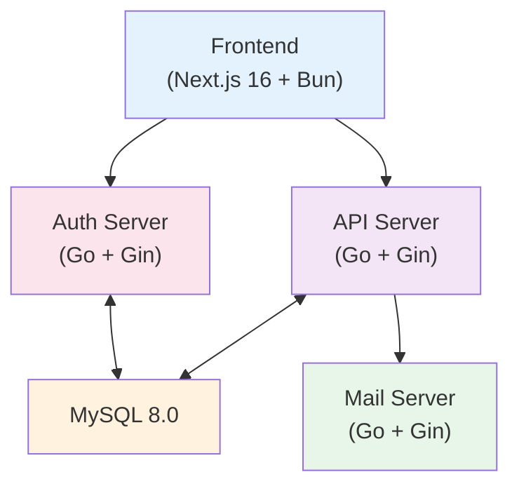
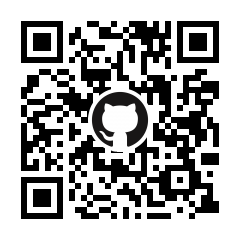
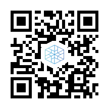

---
# You can also start simply with 'default'
theme: ../../../common/theme/UniPro_2
# random image from a curated Unsplash collection by Anthony
# like them? see https://unsplash.com/collections/94734566/slidev
# background: https://cover.sli.dev
# some information about your slides (markdown enabled)
title: UniQUE - 内製OAuth2/OIDC認証基盤のセキュリティ実装
info: |
  ## UniQUE - 内製OAuth2/OIDC認証基盤のセキュリティ実装
  UniProject向けに開発した統合認証基盤におけるセキュリティ対策の実装について紹介します。
# apply unocss classes to the current slide
# class: text-center
# https://sli.dev/features/drawing
drawings:
  persist: false
# slide transition: https://sli.dev/guide/animations.html#slide-transitions
transition: slide-left
# enable MDC Syntax: https://sli.dev/features/mdc
mdc: true
colorSchema: light
# open graph
seoMeta:
  # By default, Slidev will use ./og-image.png if it exists,
  # or generate one from the first slide if not found.
  ogImage: auto
  # ogImage: https://cover.sli.dev
  twitterSite: yuito_it_
  twitterCard: summary_large_image
  articleAuthor: "Yuito Akatsuki"
  articlePublishedTime: "2026-02-14"
  articleModifiedTime: "2026-02-14"
layout: intro-image
image: "./static/imgs/thumbnail.png"
talksSiteMetadata:
  event: セキュリティ・キャンプフォーラム 2026
  date: "2026-02-14"
  location: Online
  topic: UniQUE - 内製OAuth2/OIDC認証基盤のセキュリティ実装
  info: |
    UniProject向けに開発した統合認証基盤におけるセキュリティ対策の実装について紹介します。
duration: 5min
timer: countdown
---

<div class="absolute top-10">
  <span class="font-700">
    UniPro インフラチーム / セキュリティ・キャンプフォーラム 2026
  </span>
</div>

<div class="absolute bottom-3">
  <h1>UniQUE</h1>
  <p>内製OAuth2/OIDC認証基盤のセキュリティ実装</p>
</div>

<!--
こんにちは、あかつきゆいとです。

本日は、UniProjectで開発している統合認証基盤「UniQUE」のセキュリティ実装についてお話しします。
-->

---

# UniProject とは

<v-clicks>

<div class="grid grid-cols-2 gap-6">
  <div>
    <h3 class="text-lg font-bold mb-2 text-pink-600 opacity-0">💡 Mission</h3>
    <p class="text-base">すべての人にツクル楽しさを</p>
    <h3 class="text-lg font-bold mt-4 mb-2 text-blue-600">🎯 Vision</h3>
    <ul class="text-sm space-y-1">
      <li>✓ 他分野の方とも交流できるコミュニティづくり</li>
      <li>✓ 個々の環境に関わらず創作活動に取り組める環境づくり</li>
    </ul>
  </div>
  
  <div>
    <h3 class="text-lg font-bold mb-2 text-green-800">🛠️ 技術面での活動</h3>
    <ul class="text-sm space-y-1">
      <li>✓ <strong>Proxmox VE</strong> 基盤提供</li>
      <li>✓ <strong>Kubernetes</strong> 基盤提供</li>
      <li>✓ メールサーバー・Wiki運営</li>
    </ul>
    <div class="mt-4 p-3 bg-purple-50 rounded">
      <p class="text-xs">技術面以外でも<br/>さまざまな活動を行っています</p>
    </div>
  </div>
</div>

<div class="mt-6 p-4 bg-blue-50 rounded-lg">
  <strong>技術面での運営方針:</strong> できる限り無料で / オープンに / セキュアに
</div>

</v-clicks>

<!--
まず、UniProjectについて簡単に説明します。

UniProjectのMissionは「すべての人にツクル楽しさを」です。

Visionとして、他分野の方とも交流できるコミュニティづくり、そして個々の環境に関わらず創作活動に取り組める環境づくりを目指しています。

技術面では、Proxmox VEやKubernetes基盤を提供しており、メールサーバーやWikiなども運営しています。技術面以外でも様々な活動を行っています。

技術面での運営方針として、できる限り無料で、オープンに、そしてセキュアに運営することを心がけています。
-->

---

# UniQUE とは

<v-clicks>

**UniProject向け統合認証基盤**

- OAuth2 / OIDC 完全準拠
- マイクロサービスアーキテクチャ
- Go + Next.js + MySQL で構成

<div class="mt-8 grid grid-cols-3 gap-4">
  <div class="p-3 bg-pink-50 rounded text-center">
    <div class="font-bold text-pink-600">auth.uniproject.jp</div>
    <div class="text-sm text-gray-600">認証・認可サーバー</div>
  </div>
  <div class="p-3 bg-blue-50 rounded text-center">
    <div class="font-bold text-blue-600">api.uniproject.jp</div>
    <div class="text-sm text-gray-600">リソースAPIサーバー</div>
  </div>
  <div class="p-3 bg-green-50 rounded text-center">
    <div class="font-bold text-green-600">unique.uniproject.jp</div>
    <div class="text-sm text-gray-600">フロントエンド</div>
  </div>
</div>

</v-clicks>

<!--
UniQUEは、UniProject向けの統合認証基盤です。

OAuth2とOIDCの標準に完全準拠しており、マイクロサービスアーキテクチャで構成されています。

技術スタックとしては、GoとNext.js、MySQLを使用しています。

3つのドメインで構成されており、認証・認可サーバー、リソースAPI、フロントエンドがそれぞれ独立して動作します。
-->

---

# システムアーキテクチャ

<div class="flex items-center justify-center h-full max-h-[60vh] overflow-auto">



<div class="mt-4 grid grid-cols-2 gap-4 text-sm">
  <div><strong>Auth Server:</strong> OAuth2/OIDC 認証・認可</div>
  <div><strong>API Server:</strong> ユーザー管理・RBAC</div>
  <div><strong>Frontend:</strong> UI・ダッシュボード</div>
  <div><strong>Mail Server:</strong> メール認証通知</div>
</div>

</div>

<!--
システム全体は、マイクロサービスアーキテクチャで構成されています。

Authサーバーが認証と認可を担当し、APIサーバーがユーザー管理とRBACを担当します。

フロントエンドはNext.jsで構築されており、メールサーバーが認証メールなどを送信します。

すべてGoで書かれており、データベースはMySQL 8.0を使用しています。
-->

---
transition: none
---

# セキュリティ対策① - JWE 暗号化

<v-clicks>

## Refresh Token の取り扱い方針（実装準拠）

- **目的:** Refresh Token の中身(構造)がトークンから読み取れないことを保証しつつ、サーバー側で保有する情報は最小化する
- **実装方針（UniQUE-Auth準拠）:**
  - 発行するトークンはコンパクト JWE（暗号化済）をクライアントへ返却する
  - トークンはオプションで接頭辞を付ける: `<kid>:<compact-jwe>`（`kid` は鍵識別子, hex 64 文字）
  - DB にはトークンの平文や暗号化データそのものは保存せず、トークンの識別子（`RefreshTokenJti` 等）やメタだけを保持する

</v-clicks>

---
transition: none
---

<v-clicks>

## 検証フロー（実装に合わせた簡潔版）

1. クライアントが `refresh_token` を送信
2. サーバーは接頭辞の `kid` を取り除き、`jwe.ParseEncrypted` → 指定鍵優先で復号（失敗なら全鍵試行）
3. 復号した JSON から `claims.ID`（JTI）を取り出す
4. DB の `OauthToken` を `RefreshTokenJti == claims.ID` で検索し、`ConsentID` / `status` / `expires_at` を検証
5. 問題なければ新しいトークンを発行

```go
// DB検索の例（概念）
tokenset, _ := q.OauthToken.Where(q.OauthToken.RefreshTokenJti.Eq(claims.ID)).First()
if tokenset == nil || tokenset.Status == "revoked" { /* error */ }
```

<div class="mt-6 p-4 bg-blue-50 rounded">
  <strong>💡 補足:</strong> 実装は「暗号化されたトークンを復号してJTIで照合する」方式で、DBにトークン平文や暗号化データを保存しないため、DB漏洩時でもトークン中身は判読されにくい。また、Tokenの構造も割れにくく、偽造されにくい。
</div>

</v-clicks>

<!--
では、セキュリティ対策について詳しく見ていきます。

まず、Refresh Tokenの保護です。JWE暗号化を使って、Refresh Tokenを暗号化して保存しています。

これにより、Access Tokenが漏洩しても、Refresh Tokenを使った不正アクセスを防げます。

データベースには暗号化された状態で保存されるため、万が一データベースが漏洩しても、秘密鍵がなければトークンを復号できません。
-->

---

# セキュリティ対策② - 定数時間比較

<v-clicks>

## タイミング攻撃への対策

- **目的:** タイミング攻撃を防ぐ
- **実装:** `subtle.ConstantTimeCompare()` でクライアント認証

```go
// タイミング攻撃を防ぐ定数時間比較
if subtle.ConstantTimeCompare(
    []byte(clientSecret), 
    []byte(storedSecret),
) != 1 {
    return ErrUnauthorized
}
```

<div class="mt-6 p-4 bg-red-50 rounded">
  <strong>⚠️ 通常の比較の問題:</strong> 文字列の一致部分で処理時間が変わり、それを利用した攻撃が可能
</div>

</v-clicks>

<!--
次に、定数時間比較です。

クライアント認証の際に、タイミング攻撃を防ぐため、subtle.ConstantTimeCompareを使用しています。

通常の比較だと、文字列の長さや一致する部分で処理時間が変わってしまい、それを利用した攻撃が可能になります。

定数時間比較を使うことで、比較結果に関わらず常に同じ時間で処理が完了するため、タイミング攻撃を防ぐことができます。
-->

---

# セキュリティ対策③ - PKCE 実装

<v-clicks>

## PKCE (Proof Key for Code Exchange)

**Authorization Code 横取り攻撃を防ぐ**

<div class="mt-6 max-h-[60vh] overflow-auto">
  <div class="grid grid-cols-2 gap-4 text-sm">
    <div class="col-span-2">
      <ol class="list-decimal ml-6 space-y-3">
        <li><span class="font-bold">Client:</span> code_verifier を生成（ランダム）し、code_challenge = SHA256(verifier) を作成</li>
        <li><span class="font-bold">Client → Auth:</span> 認可リクエスト（code_challenge を付与）</li>
        <li><span class="font-bold">Auth → Client:</span> authorization_code を返却</li>
        <li><span class="font-bold">Client → Auth:</span> トークン交換（code_verifier を送信）</li>
        <li><span class="font-bold">Auth:</span> SHA256(verifier) == challenge を検証し、問題なければ Access Token を発行</li>
      </ol>
    </div>
  </div>
</div>

<div class="mt-4 p-3 bg-yellow-50 rounded">
  <strong>📌 重要:</strong> OAuth 2.1 で必須化される実装
</div>

</v-clicks>

<!--
次に、PKCEの実装です。

PKCEは、Authorization Codeの横取り攻撃を防ぐための仕組みです。

クライアントがランダムなcode_verifierを生成し、そのSHA256ハッシュであるcode_challengeを認可リクエスト時に送信します。

そして、トークン交換時にcode_verifierを送信し、サーバー側で検証します。これにより、Authorization Codeを盗んでも、code_verifierがないとトークンを取得できません。

OAuth 2.1では、この実装が必須化される予定です。
-->

---

# セキュリティ対策④ - 監査と保護

<v-clicks>

## 監査ログ完全記録

すべての操作をデータベースに記録

<div class="grid grid-cols-2 gap-4 mt-4">
  <div class="p-3 bg-gray-50 rounded">
    <div class="font-bold text-sm mb-2">記録内容</div>
    <ul class="text-xs space-y-1">
      <li>✓ 操作種別 (LOGIN/LOGOUT/AUTHORIZATION/CRUD)</li>
      <li>✓ IPアドレス</li>
      <li>✓ User-Agent</li>
      <li>✓ タイムスタンプ</li>
      <li>✓ ユーザーID / リソースID</li>
    </ul>
  </div>
  <div class="p-3 bg-gray-50 rounded">
    <div class="font-bold text-sm mb-2">活用方法</div>
    <ul class="text-xs space-y-1">
      <li>→ 不正アクセス検知</li>
      <li>→ セキュリティインシデント調査</li>
      <li>→ ユーザー行動分析</li>
    </ul>
  </div>
</div>

## 内部エンドポイント保護

- **Traefik Middleware:** `/internal/*` へのアクセスをブロック (priority: 100)
- **Kubernetes NetworkPolicy:** Pod間通信を制限

</v-clicks>

<!--
3つ目は、監査ログと内部エンドポイント保護です。

すべての操作を監査ログとしてデータベースに記録しています。操作種別、IPアドレス、User-Agent、タイムスタンプなどを記録することで、不正アクセスの検知やセキュリティインシデントの調査に活用できます。

また、内部エンドポイント保護として、Traefikのミドルウェアで/internal/へのアクセスをブロックし、Kubernetes NetworkPolicyでPod間通信を制限しています。

これにより、外部からの不正アクセスだけでなく、内部からの不正アクセスも防ぐことができます。
-->

---

# 技術スタック

<div class="flex items-center justify-center h-full max-h-[60vh] overflow-auto">

<table class="text-base">
<thead>
  <tr>
    <th class="px-6 py-3">Component</th>
    <th class="px-6 py-3">Stack</th>
    <th class="px-6 py-3">Key Features</th>
  </tr>
</thead>
<tbody>
  <tr>
    <td class="px-6 py-3 font-bold text-pink-600">Auth Server</td>
    <td class="px-6 py-3">Go 1.24 + Gin<br/>JWT/JWE + GORM</td>
    <td class="px-6 py-3">OAuth2/OIDC<br/>トークン管理</td>
  </tr>
  <tr class="bg-gray-50">
    <td class="px-6 py-3 font-bold text-blue-600">API Server</td>
    <td class="px-6 py-3">Go 1.24 + Gin<br/>GORM + ULID</td>
    <td class="px-6 py-3">RBAC<br/>ユーザー管理</td>
  </tr>
  <tr>
    <td class="px-6 py-3 font-bold text-green-600">Frontend</td>
    <td class="px-6 py-3">Next.js 16 + Bun<br/>MUI + Tailwind</td>
    <td class="px-6 py-3">App Router<br/>レスポンシブUI</td>
  </tr>
  <tr class="bg-gray-50">
    <td class="px-6 py-3 font-bold text-orange-600">Database</td>
    <td class="px-6 py-3">MySQL 8.0<br/>ULID + 監査ログ</td>
    <td class="px-6 py-3">マイグレーション<br/>トランザクション</td>
  </tr>
</tbody>
</table>

</div>

<!--
技術スタックをまとめます。

Authサーバーは、GoとGinを使い、JWTとJWEでトークン管理を行っています。

APIサーバーも同じくGoとGinで、GORMを使ったデータベース操作とULIDによるID管理を行っています。

フロントエンドは、Next.js 16とBunを使用し、MUIとTailwindでUIを構築しています。

データベースは、MySQL 8.0を使用し、ULIDと監査ログを活用しています。
-->

---

# デプロイ構成

<v-clicks>

## Kubernetes on Proxmox VE

<div class="grid grid-cols-2 gap-6 mt-6">
  <div>
    <h3 class="text-lg font-bold mb-3">🛠️ 構成管理</h3>
    <ul class="text-sm space-y-2">
      <li>✓ <strong>Kustomization</strong> でマニフェスト管理</li>
      <li>✓ <strong>Harbor</strong> プライベートレジストリ</li>
      <li>✓ <strong>自動イメージ更新</strong></li>
    </ul>
  </div>
  <div>
    <h3 class="text-lg font-bold mb-3">🌐 ネットワーク</h3>
    <ul class="text-sm space-y-2">
      <li>✓ <strong>Traefik Ingress</strong> (TLS + 内部保護)</li>
      <li>✓ <strong>NetworkPolicy</strong> で通信制限</li>
      <li>✓ <strong>水平スケーリング</strong> (replicas: 2)</li>
    </ul>
  </div>
</div>

<div class="mt-6 p-4 bg-blue-50 rounded">
  <strong>System Cluster:</strong> UniPro基盤サービス専用<br/>
  <strong>Tenant Cluster:</strong> メンバー向け開放予定
</div>

</v-clicks>

<!--
デプロイ構成については、Kubernetes on Proxmox VEで運用しています。

Kustomizationでマニフェストを管理し、Harborというプライベートレジストリを使用しています。また、イメージの自動更新も行っています。

ネットワーク面では、TraefikでIngressを管理し、TLS証明書と内部エンドポイント保護を実装しています。NetworkPolicyで通信を制限し、水平スケーリングで可用性を確保しています。

現在はSystem Clusterとして基盤サービスを運用しており、今後Tenant Clusterとしてメンバーに開放する予定です。
-->

---

# 今後の展開

<v-clicks>

<div class="grid grid-cols-2 gap-6">
  <div class="p-6 bg-gradient-to-br from-pink-50 to-purple-50 rounded-lg">
    <h3 class="text-xl font-bold mb-4 text-pink-600">🔐 セキュリティ強化</h3>
    <ul class="space-y-2">
      <li>✓ <strong>MFA/TOTP</strong> 実装 (2026 A-B)</li>
      <li>✓ <strong>WebAuthn</strong> 対応検討</li>
      <li>✓ <strong>リスクベース認証</strong></li>
      <li>✓ <strong>DPoP認証</strong></li>
    </ul>
  </div>
  
  <div class="p-6 bg-gradient-to-br from-blue-50 to-cyan-50 rounded-lg">
    <h3 class="text-xl font-bold mb-4 text-blue-600">🚀 機能拡張</h3>
    <ul class="space-y-2">
      <li>✓ <strong>管理画面</strong>の強化</li>
      <li>✓ <strong>パフォーマンス</strong>最適化</li>
      <li>✓ <strong>ドキュメント</strong>整備</li>
      <li>✓ <strong>Traefik Middleware</strong>整備</li>
    </ul>
  </div>
</div>

</v-clicks>

<!--
最後に、今後の展開についてです。

セキュリティ強化として、MFAやTOTPの実装を2026年前半に予定しています。また、WebAuthnの対応も検討中です。

機能拡張としては、管理画面の強化やパフォーマンス最適化、ドキュメント整備を進めていきます。
-->

---

# ご清聴ありがとうございました！

<div class="flex items-center justify-center h-full">
  <div class="w-full max-w-4xl">
    <div class="grid grid-cols-12 gap-6 items-center">
      <div class="col-span-12">
        <p class="text-base text-gray-700 mb-3">展示ブースでデモ実施中 — お気軽にお立ち寄りください</p>
        <div class="mt-6 flex items-center gap-6">
          <div class="flex flex-col items-center">
            <div class="w-28 h-28 bg-white border rounded-md shadow flex items-center justify-center">
              
            </div>
            <div class="text-xs text-gray-600 mt-2">Slides</div>
          </div>
          <div class="flex flex-col items-center">
            <div class="w-28 h-28 bg-white border rounded-md shadow flex items-center justify-center">
              
            </div>
            <div class="text-xs text-gray-600 mt-2">GitHub</div>
          </div>
          <div class="flex flex-col items-center">
            <div class="w-28 h-28 bg-white border rounded-md shadow flex items-center justify-center">
              
            </div>
            <div class="text-xs text-gray-600 mt-2">Website</div>
          </div>
        </div>
      </div>
    </div>
  </div>
</div>

<!-- 以上で、UniQUEの技術紹介を終わります。 -->
